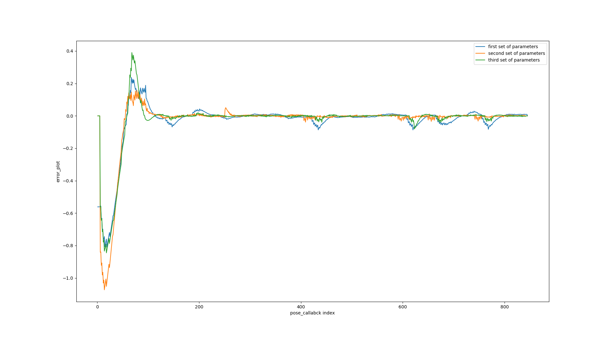

5.1 Line following With PID control

1. The error -np.sin(car_theta)*(plan[goal_idx][0] - car_pose[0]) + np.cos(car_theta) * (plan[goal_idx][1] - car_pose[1]) is an error measurement used to determine the vehicles distance and direction (left or right) from the desired path taking into account its heading. It is a choice, for a PID controller as it provides information to adjust the steering and minimize any deviation from the intended path effectively.

2. The initial set of PID parameters likely performed well because they offered an approach to error correction. The proportional, integral and derivative gains were carefully tuned to meet the dynamics and requirements of the robot without causing overshooting, oscillations or instability. Lower gains may have contributed to maintaining an smooth response to errors, which's crucial for accurate and reliable path tracking in mobile robots. We utilized Ziegler Nichols method for tuning PID resulting in values of [Kp=0.9,Ki=0.6,Kd=0.05].

3. To successfully implement PID control in real world robot trajectory following it is essential for the robot to possess an dependable localization system that can determine its position and orientation accurately. This plays a role in calculating the error, between the robots movement and the desired trajectory.
Furthermore the robot requires sensors such, as GPS, LiDAR or encoders. It also needs data processing capabilities to perform real time computations. Additionally there should be a mechanism in place to translate the PID output, into movements of the actuators. If the robot lacks localization and pose estimation it won't be able to calculate the error required for PID adjustments.

5. 

6. Videos are provided in Videos folder

5.2

1. The delta values are taken by trial and error method the min delta we have taken is -0.24 and max delta is 0.0241. We also need to change speed of car in real scenario. THe frequency rate to a topic were also changed almsolt upto 60hz.

2. Videos are provided in Videos folder

3. Videos are provided in Videos folder

