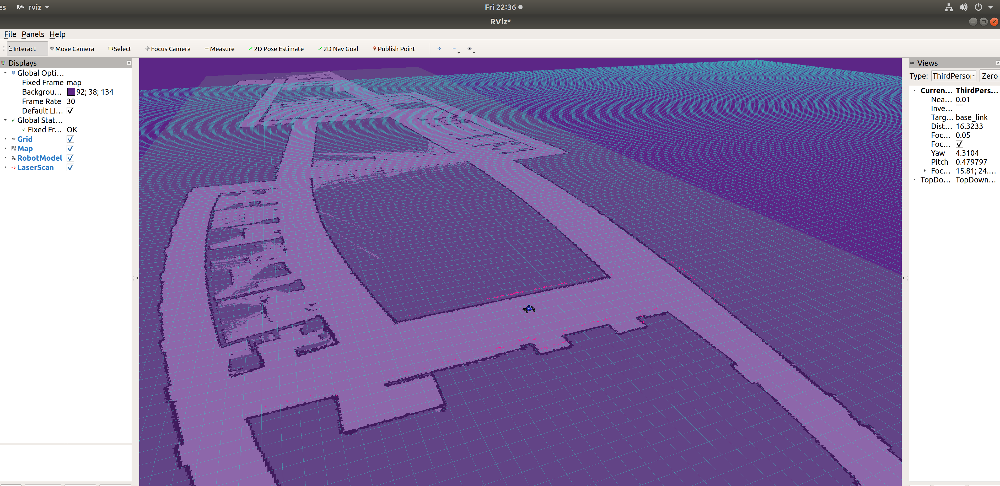

# Project 1: Introduction 

Node: A node in ROS is basically a process that performs computation. Each node is designed to perform a specific task. For instance, one node might handle data from a laser rangefinder while another node controls wheel motors. ROS is designed to be modular, so by separating tasks into nodes, it becomes more manageable and scalable.

Topic: A topic is a name for a stream of messages with a specific type. For instance, a robot might have a topic named /laser_scan that streams data from a laser rangefinder. Topics enable asynchronous communication between nodes.

Publisher:
A publisher is a node or part of a node that sends (or "publishes") data to a topic. So, if you have a sensor reading data, the part of the node that takes this data and sends it out for other nodes to use would be the publisher.

Subscriber:
A subscriber, on the other hand, is a node or part of a node that "listens" (or "subscribes") to a topic to receive data. For example, if a robot has a node that needs data from a laser rangefinder to make decisions, this node would subscribe to the /laser_scan topic to get that data.

How they relate:
Node A would be the publisher that publishes camera data to a topic named, say, /camera_data.
Node B would be the subscriber that subscribes to the /camera_data topic to receive the data published by Node A and process it.
In this way, ROS promotes a decoupled system where data producers (publishers) and data consumers (subscribers) interact via topics, making the overall robotic system modular and scalable.

Launch file: A launch file in ROS simplifies the initialization of multiple nodes at once, allowing for configuration, parameter setting, and namespace grouping. It also supports conditional launching, hierarchical inclusion, and topic remapping, streamlining the setup and interrelation of robotic software components.

Replace this with your own writeup!

