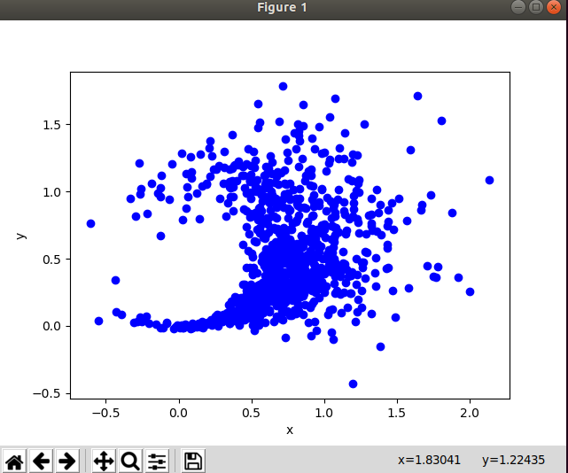
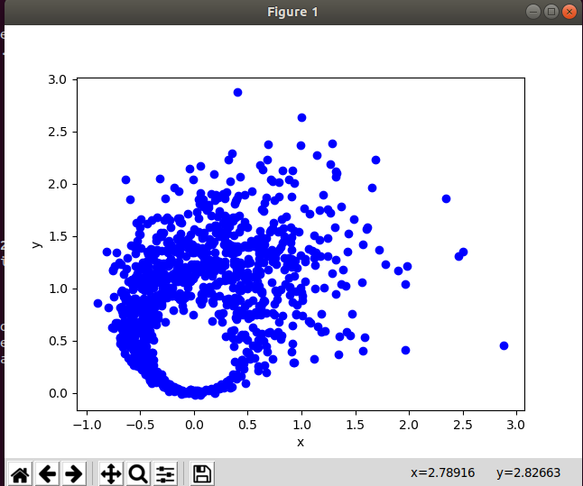
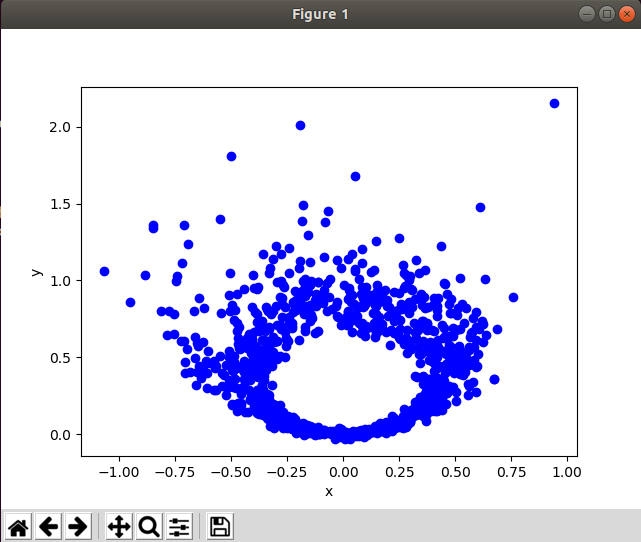
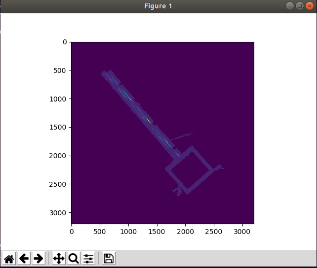
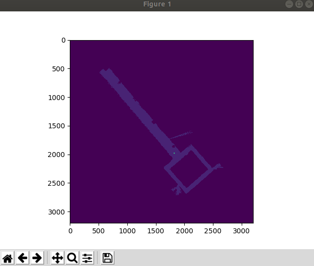
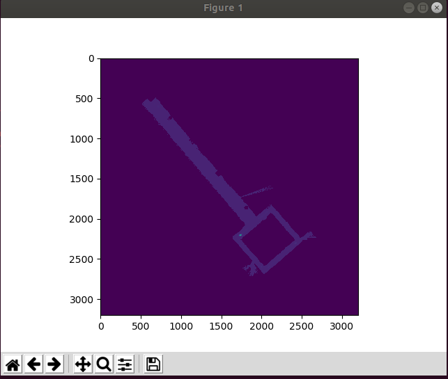
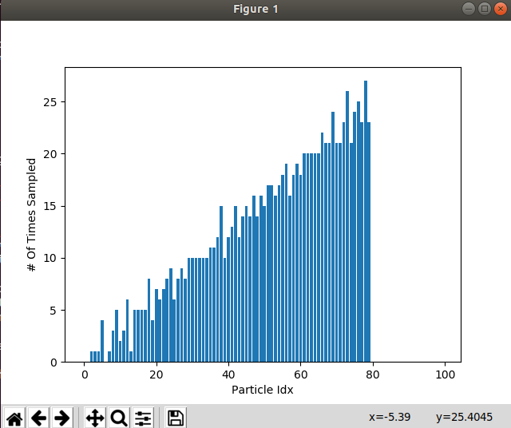
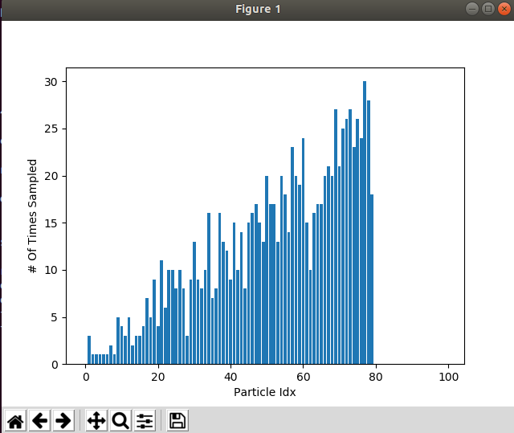
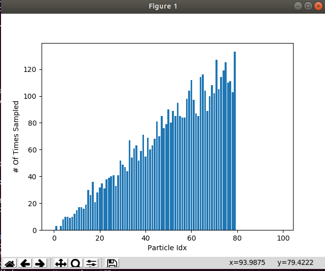

[5.1]
1. Test Speed:1          Steering Angle:0.34     Time interval:1

   Test Speed:1.5          Steering Angle:0.5     Time interval:1.5

   Test Speed:2          Steering Angle:0.7     Time interval:2

2. We decide to choose the noise intuitively initially.

3. We tried to increase velocity noise as per the lagh which we were facing while observing the car and same for the noise theta and for the std deviation we have to do few trials and errors to get distribution.

4. KM_V_NOISE = 0.5  
   KM_DELTA_NOISE = 0.15  
   KM_X_FIX_NOISE = 0.015  
   KM_Y_FIX_NOISE = 0.015 
   KM_THETA_FIX_NOISE = 0.5 

[5.2]

1. 
   
   

2. For the mixing weights we tried to vislulise the graphs and we tried to match them with the graphs which are given for refernce in the book. We gave a large value like 15 and then we tuned and reduced it using trial and error method.

3. We used the same appraoch as mentioned in point 2.

4.   Z_SHORT = 0.25 
     Z_MAX = 0.01 
     Z_RAND = 0.10  
     Z_HIT = 0.64 

[5.3]
1. 
   

    
    
2. The low-variance method for resampling in a particle filter is better because it keeps a good mix of particles. This mix helps the filter give a more accurate picture of where something might be. The naïve method is not as good because it can end up focusing on just a few particles too much. This can make the filter think it's more certain than it should be, and it might miss out on other possibilities.

3. 
   

4.  After 50 trials

[5.4]
1. Video is in Videos folder

2. Video is in Videos folder